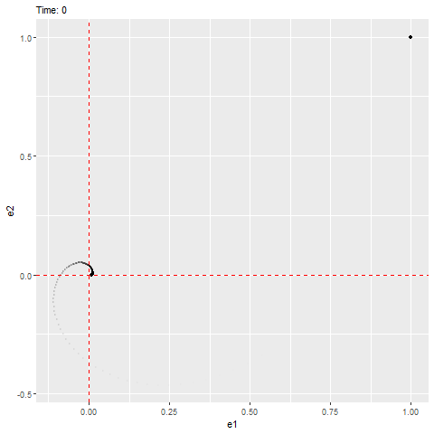

# Week 10 - Lotka-Volterra competition model - Visualization of dynamics with complex eigenvalues {-} 


In class, we learned that the stability of a nonlinear ODE can be characterized by studying the dynamics of the "displacement for the equilibrium" ($\pmb\varepsilon$), which follows a much simpler linear ODE. If the linear ODE describing the dynamics of the displacement have a stable equilibrium at zero, then this indicates that the original equilibrium of the nonlinear ODE will also be stable. Consider the case where the dynamics of displacements $\pmb\varepsilon$ can be described by the following linear ODE:

\[
\dfrac{d \vec{\pmb\varepsilon}}{d t} = \mathcal{J}\vec{\pmb\varepsilon}
\]

We can see that this ODE has an equilibrium at zero and the eigenvalues are as follows, which have negative real parts (indicating that it'll be stable) with a non-zero imaginary part (indicating that it'll rotate towards the equilibrium, as shown below).

```{r}
eigen(matrix(c( -1, 1, -2, -1), 2, 2, T))$values # eigenvalues
```

where $\vec{\pmb\varepsilon} = (\varepsilon_1, \varepsilon_2)^T$ and $\mathcal{J} = \begin{pmatrix} -1 & 1\\ -2 & -1 \end{pmatrix}$.
Or, we can write the linear system by two ODEs:
\begin{align*}
  \dfrac{d \varepsilon_1}{d t} &= (-1)\times \varepsilon_1 + (1)\times\varepsilon_2\\
  \dfrac{d \varepsilon_2}{d t} &= (-2)\times \varepsilon_1 + (-1)\times\varepsilon_2\\
\end{align*}

Note that the element in the first row and second column is positive.

```{r, echo = T, results = 'hold', message=FALSE}
library(ggplot2)
library(tidyverse)
library(deSolve)
library(gganimate)
library(gifski)

  ### Model specification
  ERROR <- function(times, state, parms) {
    with(as.list(c(state, parms)), {
      de1_dt = c1 * e1 + c2 * e2
      de2_dt = d1 * e1 + d2 * e2
      return(list(c(de1_dt, de2_dt)))
    })
  }
  
  ### Model parameters
  times <- seq(0, 10, by = 0.0001)
  state <- c(e1 = 1, e2 = 1)
  parms <- c(c1 = -1, c2 = 1, d1 = -2, d2 = -1)
  
  ### Model application
  error <- ode(func = ERROR, times = times, y = state, parms = parms)
  tail(error)
  plot(e1 ~ e2, error, type = "l")
```




