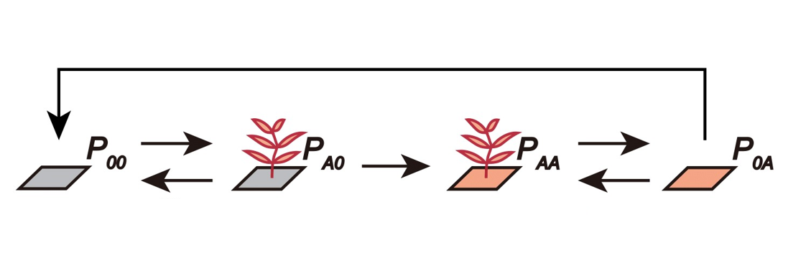
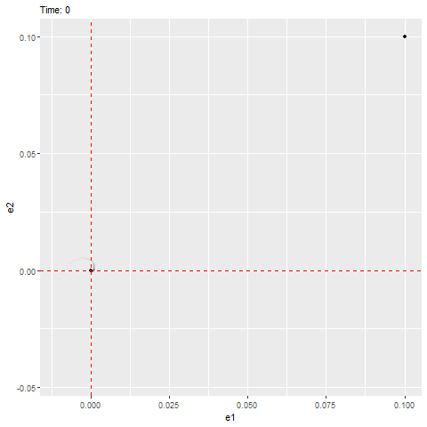
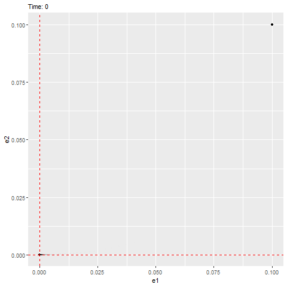

--- 
title: "Introduction to Theoretical Ecology"
author: "Instructor: Po-Ju Ke $~~~~~$ Teaching Assistant: Guan-Yu Chen"
date: "2025 Fall at National Taiwan Univeristy "
output:
  html_document:
    df_print: paged
github-repo: pojuke/TheoreticalEcologyPJK
cover-image: bifurcation.gif
site: bookdown::bookdown_site
documentclass: book
bibliography:
- book.bib
- packages.bib
biblio-style: apalike
link-citations: yes
description: This is the course website for **_Introduction to Theoretical Ecology_**
  2025 Fall at National Taiwan University.
url: https://pojuke.github.io/TheoreticalEcologyPJK/
---
# Course information{-}
<p style = "font-size: 24pt; margin-bottom: 5px; margin-top: 25px"> **Description** </p> The development of theory plays an important role in advancing ecology as a scientific field. This three-unit course is for students at the graduate or advanced undergraduate level. The course will cover classic theoretical topics in population and community ecology, staring from single-species dynamics and gradually build up to multispecies models. Emphasis will be on theoretical concepts and corresponding mathematical approaches.

This course is designed as a two-hour lecture (written on black board) followed by a one-hour complementary hands-on practice module. In the lecture, we will analyze dynamical models and discuss their theoretical implications. In the practice section, we will use a combination interactive applications and numerical simulations to gain more intuition of the dynamics and behavior of different models. 

<p style = "font-size: 24pt; margin-bottom: 5px; margin-top: 25px"> **Objective** </p>
By the end of the course, students are expected to be familiar with the basic building blocks of ecological models, and would be able to formulate and analyze simple models of their own. The hands-on practice component should allow students to link their ecological intuition with the underlying mathematical model, helping them to better understand the primary literature of theoretical ecology. 

<p style = "font-size: 24pt; margin-bottom: 5px; margin-top: 25px"> **Requirement** </p>
Students are only expected to have a basic understanding of **Calculus** (e.g., freshman introductory course) and **Ecology**. It's OK if you're not familiar with calculus as we will provide relevant material for you to review during the first week.

<p style = "font-size: 24pt; margin-bottom: 5px; margin-top: 25px"> **Format** </p>
Thursday 6,7,8 (1:20 pm ~ 4:20 pm) at Gongtong 207


<p style = "font-size: 24pt; margin-bottom: 5px; margin-top: 25px"> **Grading** </p>
The final grade consists of:

(1) Assignment problem sets (60%)
(2) Midterm exam (15%)
(3) Final exam (15%)
(4) Course participation (10%)

<p style = "font-size: 24pt; margin-bottom: 5px; margin-top: 25px"> **Course materials** </p>
We will use a combination of textbooks of theoretical ecology. Textbook chapters and additional reading materials (listed in the course outline) will be provided. (see [**Syllabus**](https://pojuke.github.io/TheoreticalEcologyPJK/syllabus.html) for more details).

Below are the textbook references:

(1) *A Primer of Ecology* (4^th^ edition). Nicholas Gotelli, 2008. 
(2) *An Illustrated Guide to Theoretical Ecology*. Ted Case, 2000. 
(3) *A Biologist's Guide to Mathematical Modeling in Ecology and Evolution*. Sarah Otto & Troy Day, 2011. 
(4) *Mathematical Ecology of Populations and Ecosystems*. John Pastor, 2008. 
(5) *Nonlinear Dynamics and Choas*. Steven Strogatz, 2000.


<p style = "font-size: 24pt; margin-bottom: 5px; margin-top: 25px"> **Contacts** </p>
**Instructor**: Po-Ju Ke

- Office: Life Science Building R635
- Email: pojuke@ntu.edu.tw
- Office hours: by appointment

**Teaching assistant**: Guan-Yu Chen

- Office: Life Science Building R635
- Email: r13b44005@ntu.edu.tw
- Office hours: by appointment


# Syllabus {-}
```{r, echo = FALSE, message = F, warning = F, error = F}
library(tidyverse)
library(knitr)
library(kableExtra)

syllabus <- tibble(
  Date = c("**Week 1** <span style='vertical-align:-30%'> </span>
           <br> 9/4",
           "**Week 2** <span style='vertical-align:-30%'> </span>
           <br> 9/11",
           "**Week 3** <span style='vertical-align:-30%'> </span>
           <br> 9/18",
           "**Week 4** <span style='vertical-align:-30%'> </span>
           <br> 9/25",
           "**Week 5** <span style='vertical-align:-30%'> </span>
           <br> 10/2",
           "**Week 6** <span style='vertical-align:-30%'> </span>
           <br> 10/9",
           "**Week 7** <span style='vertical-align:-30%'> </span>
           <br> 10/16",
           "**Week 8** <span style='vertical-align:-30%'> </span>
           <br> 10/23",
           "**Week 9** <span style='vertical-align:-30%'> </span>
           <br> 10/30",
           "**Week 10** <span style='vertical-align:-30%'> </span>
           <br> 11/6",
           "**Week 11** <span style='vertical-align:-30%'> </span>
           <br> 11/13",
           "**Week 12** <span style='vertical-align:-30%'> </span>
           <br> 11/20",
           "**Week 13** <span style='vertical-align:-30%'> </span>
           <br> 11/27",
           "**Week 14** <span style='vertical-align:-30%'> </span>
           <br> 12/4",
           "**Week 15** <span style='vertical-align:-30%'> </span>
           <br> 12/11",
           "**Week 16** <span style='vertical-align:-30%'> </span>
           <br> 12/18"),
  
  `Lecture topic` = c("Introduction: what is theoretical ecology?", #week1
                      "Exponential population growth", #week2
                      "Logistic population growth and stability analysis", #week3
                      "Discrete population growth and stability analysis", #week4
                      "Metapopulations and patch occupancy models", #week5
                      "Harvesting and bifurcation", #week6
                      "Age-structured population models", #week7
                      "Lotka-Volterra model of competition: graphical analysis", #week8
                      "**Midterm exam**", #week9
                      "Lotka-Volterra model of competition: invasion analysis and linear stability analysis", #week10
                      "Predator-prey interactions (I)", #week11
                      "Predator-prey interactions (II)", #week12
                      "Multispecies models of predation: apparent competition", #week13
                      "Mechanistic models for consumer-resource dynamics", #week14
                      "Research applcations: plant-soil feedback as an example", #week15
                      "**Final exam**"), #week16
    
  Lab = c(" \\- ", #week1
          'Solving exponential growth equation using "deSolve" & Visualization', #week2
          "Simulating logistic growth", #week3
          "Logistic map and Ricker diagram", #week4
          "Metapopulations and patch occupancy models", #week5
          "Bifurcation diagram", #week6
          "Age-structured population model", #week7
          "Simulating competitive dynamics and invasion growth", #week8
          " \\-", #week9
          "Visualization of dynamics with complex eigenvalues", #week10
          "Lotka-Volterra model of predator-prey interactions and time-scale separation", #week11
          "Rosenzweig-MacArthur predator-prey model", #week12
          "Consumer-resource dynamics", #week13
          "Parameter space for apparent competition model", #week14
          " \\- ", #week15
          " \\- "), #week16
    
    
  Readings = c("[**Grainger et al., 2021**](https://doi.org/10.1086/717206)",
               "Gotelli [Ch.1], Case[Ch.1]", #week2
               " \\- ", #week3
               "Gotelli [Ch.2], Case[Ch.5], Otto & Day[Ch.5],
               [**May., 1976**](https://doi.org/10.1038/261459a0)", #week4
               "Gotelli [Ch.4], Case[Ch.16]", #week5
               "Pastor [Ch. 7], Strogatz [Ch. 3]", #week6
               "Gotelli [Ch.3], Case[Ch.3]", #week7
               "Gotelli [Ch.5], Case[Ch.14], 
               [**Broekman et al., 2019**]( https://doi.org/10.1111/ele.13349)", #week8
               " \\- ", #week9
               "Otto & Day [Ch.8],
               [**May., 1972**](https://www.nature.com/articles/238413a0)", #week10
               "Gotelli [Ch.6], Case[Ch.12, 13]", #week11
               "Gotelli [Ch.6], Case[Ch.12, 13]", #week12
               "[**Tilman., 1980**](https://doi.org/10.1086/283633),
               [**Armstrong & McGehee., 1980**](https://doi.org/10.1086/283553)", #week13
               "[**Holt., 1977**](https://doi.org/10.1016/0040-5809(77)90042-9)", #week14
               " \\- ",
               " \\- ")  
  
)

kbl(syllabus, align = "cccl", escape = F) %>%  
  kable_paper(full_width = T, 
              html_font = "Arial",
              font_size = 17) %>%
  kable_styling(bootstrap_options = c("bordered")) %>%
  row_spec(0, bold = T, color = "black", font_size = 20) %>%
  column_spec(1, width = "10em", border_right = T) %>%
  column_spec(2, width = "17em") %>%
  column_spec(3, width = "17em") %>%
  column_spec(4, width = "13em")

```


<!--chapter:end:index.Rmd-->

```{r setup, include = FALSE}
knitr::opts_chunk$set(message = F, 
                      error = F, 
                      warning = F)

```

# Week 2 - Exponential population growth {-} 

In part 1, we will solve the differential equation for exponential population growth and visualize how the population sizes change over time. 

<br>

**Part 1 - Numerical solution using the package `deSolve`**

Two main phases:

(1) Model specification: specify the structure of differential equation model

(2) Model application: set the time steps, initial population size and model parameters (e.g., intrinsic population growth rate $r$), and then solve the equation model

<style>

p span#aaa:before { 
  content: "(1) "; 
  display: inline-block;
  margin-left: -1.5em;
  margin-right: 0.3em;
}

p span#bbb:before { 
  content: "(2) "; 
  display: inline-block;
  margin-left: -1.5em;
  margin-right: 0.3em;
}

d-article table.lightable-paper {
  margin-bottom: 0px; 
}

</style>

Consider the model
\[
\frac{dN}{dt} = rN
\]
where $N$ is population size and $r$ is the intrinsic growth rate.
```{r}
###### part 1 ######
# install.packages("deSolve")
library(deSolve)

### (1) Model specification
exponential_model <- function(times, state, parms) {
  with(as.list(c(state, parms)), {
    dN_dt = r*N  # Exponential growth equation
    return(list(c(dN_dt)))  # Return the results
  })
}
```

Set the time steps, initial population size and model parameters.
```{r}
### (2) Model application
times <- seq(0, 10, by = 0.1)  # Time steps to integrate over
state <- c(N = 10)  # Initial population size
parms <- c(r = 1.5)  # Intrinsic growth rate
```

Solve the equation by `ode()` numerically.
```{r}
# Run the ode solver
pop_size <- ode(func = exponential_model, times = times, y = state, parms = parms)

# Take a look at the results
head(pop_size)
```

Visualization
```{r}
plot(N ~ time, data = pop_size)
```

Compare simulation result with analytic solution, which is
\[
N(t) = N_0\exp\{rt\}
\]
```{r}
par(mfrow = c(1,2))
plot(N ~ time, data = pop_size) # Plot simulation data
curve(state[1]*exp(parms[1]*x), col = "red", add = T) # Adding analytic solution
plot(N ~ time, data = pop_size, log = "y") # Plot logged simulation data
curve(state[1]*exp(parms[1]*x), col = "red", add = T) # Adding analytic solution
```


<br>

**Part 2 - Comparing different ode solvers and different time intervals**
<br>
In default of `ode()`, the equations are solved by LSODA method. We can change the method by modifying the argument `method` in `ode()`. 

```{r}

###### part 2 ######
# Original setting
times <- seq(0, 10, by = 0.1)  # Time steps to integrate over
state <- c(N = 10)  # Initial population size
parms <- c(r = 1.5)  # Intrinsic growth rate
# Default: LSODA
pop_size <- ode(func = exponential_model, times = times, y = state, parms = parms)

# Euler's method
pop_size_1 <- ode(func = exponential_model, times = times, y = state, parms = parms, method = "euler")

# Compare different method
par(mfrow = c(1,2))
plot(N ~ time, data = pop_size, main = "LSODA")
curve(state[1]*exp(parms[1]*x), times[1], times[length(times)], col = "red", add = T) # correct curve
plot(N ~ time, data = pop_size_1, main = "Euler")
curve(state[1]*exp(parms[1]*x), times[1], times[length(times)], col = "red", add = T) # correct curve

# Different time intervals
times_1 <- seq(0, 10, by = 1)  # time steps to integrate over
times_2 <- seq(0, 10, by = 0.1)  # time steps to integrate over
times_3 <- seq(0, 10, by = 0.01)  # time steps to integrate over

# Euler's method
pop_size_1 <- ode(func = exponential_model, times = times_1, y = state, parms = parms, method = "euler")
pop_size_2 <- ode(func = exponential_model, times = times_2, y = state, parms = parms, method = "euler")
pop_size_3 <- ode(func = exponential_model, times = times_3, y = state, parms = parms, method = "euler")

# Compare different time intervals
par(mfrow = c(1,3))
plot(N ~ time, data = pop_size_1, main = "Time intervals = 1")
curve(state[1]*exp(parms[1]*x), col = "red", add = T) # correct curve
plot(N ~ time, data = pop_size_2, main = "Time intervals = 0.1")
curve(state[1]*exp(parms[1]*x), col = "red", add = T) # correct curve
plot(N ~ time, data = pop_size_3, main = "Time intervals = 0.01")
curve(state[1]*exp(parms[1]*x), col = "red", add = T) # correct curve
```

<br>

**Part 3 - Solving exponential growth model with fluctuating growth rate**
<br>
Consider the model
\[
\frac{dN}{dt} = r(t)N \ \text{, } r(t) = \overline{r} + \sigma\sin(\omega t)
\]
where $\overline{r}$ and $\omega$ are constants.
The analytic solution of the ode model is 
\[
N(t) = N_0\exp\{\overline{r}t - \frac{\sigma}{\omega}[\cos(\omega t) - 1]\}
\]

```{r}
###### part 3 ######
### Model specification
exponential_model_fluc <- function(times, state, parms) {
  with(as.list(c(state, parms)), {
    dN_dt = (r_bar + sigma*sin(omega*times))*N  # exponential growth equation
    return(list(c(dN_dt)))  # return the results
  })
}
```


```{r}
### Parameters
times <- seq(0, 10, by = 0.1)  # time steps to integrate over
state <- c(N = 10)  # initial population size
parms <- c(r_bar = 1.5, sigma = 5, omega = 2*pi)  # intrinsic growth rate
```

Plot $r(t)$
```{r}
### Fluctuating growth rate
r = parms[1] + parms[2]*sin(parms[3]*times)
plot(r ~ times, type = "l")
```

```{r}
### Solving model
pop_size <- ode(func = exponential_model_fluc, times = times, y = state, parms = parms)

### Plotting
plot(N ~ times, data = pop_size)
curve(state[1]*exp(parms[1]*x - parms[2]/parms[3]*(cos(parms[3]*x) - 1)), add = T, col = "red") # correct curve
plot(N ~ times, data = pop_size, log = "y")
curve(state[1]*exp(parms[1]*x - parms[2]/parms[3]*(cos(parms[3]*x) - 1)), add = T, col = "red") # correct curve
```

Adjust $\overline{r}$
```{r}
### Parameters
times <- seq(0, 10, by = 0.1)  # time steps to integrate over
state <- c(N = 10)  # initial population size
parms <- c(r_bar = 0.1, sigma = 5, omega = 2*pi)  # intrinsic growth rate

### Fluctuating growth rate
r = parms[1] + parms[2]*sin(parms[3]*times)
plot(r ~ times, type = "l")

### Solving model
pop_size <- ode(func = exponential_model_fluc, times = times, y = state, parms = parms)

### Plotting
plot(N ~ times, data = pop_size)
curve(state[1]*exp(parms[1]*x - parms[2]/parms[3]*(cos(parms[3]*x) - 1)), add = T, col = "red") # correct curve
```

<!--chapter:end:02_Week_2_Exponential.Rmd-->

# Week 3 - Logistic population growth and stability analysis {.unnumbered}

**Part 1 - Shining app for logistic growth**

```{r, out.width="800px", echo = F}
knitr::include_app("https://genchanghsu0115.shinyapps.io/Logistic_mod_shinyapp/", height = "500px")
```

Credit to [Gen-Chang Hsu](https://genchanghsu.github.io/index.html)

<br> <br> <br> <br> <br>

**Part 2 - Population growth with Allee effects**

Some populations experience negative growth rates when the population size is too low, a phenomenon known as "Allee effect". For example, some flowering plants require a minimal local density to attract pollinators (clustering effects). Below this density, pollinators will not be able to detect the presence of flowers and therefore the plants cannot complete their life cycle. Some flower species, e.g., *Itea*, requires a minimal population size of $A$ to attract its specialized bee pollinator and its population growth is directly related to pollinator visitation, its population dynamics can be described using the below differential equation:

$$
\frac{dN}{dt} = rN(1-\frac{N}{K})(\frac{N}{A}-1)
$$

where $0 < A < K$. The term $A$ represents "Allee threshold", below which the population growth rate is negative (because of no visiting pollinators) and thus the population will decline; $r$ is the intrinsic rate of increase and $K$ is the carrying capacity.

(1) You can calculate the equilibrium population sizes and use the graphical method to determine their stability. The equilibrium population sizes are $N^* = 0$ (stable), $N^* = A$ (unstable), and $N^* = K$ (stable).

```{r}
r = 1
A = 150
K = 500
curve(r*x*(1-x/K)*(x/A-1), from = 0, to = 550, xlim = c(0, 550),
      xlab = "N", ylab = "dN/dt", las = 1)
abline(h = 0, lty = 2)
points(y = rep(0, 3), x = c(0, A, K), pch = c(16, 1, 16))
text(x = c(0, A, K), y = rep(20, 3), labels = c("0", "A", "K"), font = 3, col = "blue")
arrows(x0 = c(100, 200, 550), y0 = -10, x1 = c(10, 450, 510), y1 = -10, length = 0.08, lwd = 2)
```

(2) Simulate the dynamics with an intrinsic rate of increase of $r$ = 1.2, the carrying capacity of $K$ = 1000, and the minimal threshold density of $A$ = 150. Observe the population trajectories to see how different initial population sizes can lead to different equilibrium population sizes (a phenomenon known as "alternative stable states").

```{r}
library(deSolve)
Allee <- function(t, state, pars) {
  with(as.list(c(state, pars)), {
    dN_dt = r*N*(1-N/K)*(N/A-1)
    return(list(c(dN_dt)))
    })
}
t <- seq(0, 7, by = 0.01)

state <- c(120,180, 300, 600, 900, 1200)
names(state) <- rep("N", time = length(state))
pars <- c(r = 1.2, A = 150, K = 1000)
par(mar = c(5, 4+2, 4,2) + 0.1)

for(i in 1:length(state)){
  #runthe ode solver
  pop_size <- ode(func = Allee, t = t, y = state[i], par = pars)
  plot(pop_size,ann = F, las =T, ylim = c(0, 1500), xlim = c(0.2,7))
  par(new = TRUE)
}
abline(h = 1000, col = "red", lty = 2)
abline(h = 150, col = "red", lty = 2)
axis(side = 2, at = 150, las = T)
title(main = paste0("Allee effect\n(r = ",pars["r"],
                  ", A = ",pars["A"],
                  ", K = ",pars["K"], ")"),
      xlab = "Time")
title(ylab = "Numberof individuals", line = 4)
```

<!--chapter:end:03_Week_3_NewLogistic.Rmd-->

# Week 4 - Discrete exponential and logistic models{-} 

**Part 1 - Model the discrete logistic population growth using for loops**
Model:
\[
N_{t+1} = N_t(1+r(1-\frac{N_t}{K}))
\]

```{r}
### (1) Define the discrete logistic growth equation
log_fun <- function(r, N, K){N + r*N*(1-N/K)}
```

You may modify $r$ to see the change in stability of equilibrium $K$.
```{r}
### (2) Set the parameters
r <- 1.8
K <- 200
N0 <- 10
time <- 100
Parms <- c(r = r, K = K)

### (3) Use for loop to iterate over the time sequence
pop_size <- data.frame(times = 1:time)
pop_size$N[1] <- N0
for(i in 2:time){
  pop_size$N[i] <- log_fun(r = r, N = pop_size$N[i - 1], K = K)
}

### (4) Population trajectory
plot(N ~ times, data = pop_size, type = "l")
abline(h = K, col = "red")
points(N ~ times, data = pop_size)
```

**Part 2 - Generic cobweb**

```{r}
###### Part 2: Generic cobweb
### (1) define function
ReturnMap <- function(Func, x0, times, xmax, curve_n = 1000, parms){
  
  # get time series iteration
  x <- rep(x0, times)
  for(i in 2:times){
    x[i] <- Func(x[i-1], parms)
  }
  
  # get fine grid for function curve
  x.grid <- seq(0, xmax, length.out = curve_n)
  y.grid <- Func(x.grid, parms)
  ymax <- max(y.grid, xmax)
  
  # create canvas
  plot(NA, xlim = c(0, xmax), ylim = c(0, ymax), xaxs = "i", yaxs = "i", bty = "l", 
       xlab = expression(N[t]), ylab = expression(N[t+1]))
  abline(a = 0, b = 1, lty = 2, col = "grey50")          
  lines(x.grid, y.grid, col = "steelblue", lwd = 2)      
  
  # cobweb (horizontal to diagonal, vertical up to function)
  segments(x0 = x[1], y0 = 0,   x1 = x[1],   y1 = x[2], col = "firebrick")
  for(i in 2:(times-1)){
    segments(x0 = x[i-1], y0 = x[i],   
             x1 = x[i],   y1 = x[i], col = "firebrick")
    segments(x0 = x[i],   y0 = x[i], 
             x1 = x[i],   y1 = x[i+1], col = "firebrick")
  }
  
}

### (2) Set up discrete logistic function with outside parameters
Logistic <- function(N, parms){
  with(as.list(parms), {
    return(N + r*N*(1-N/K))
  })
}
Parms <- c(r = r, K = K)

### (3) Use the ReturnMap function
ReturnMap(Func = Logistic,
          x0 = 10, 
          times = 150,
          xmax = 310,
          curve_n = 1000, 
          parms = Parms)
```

<br>


Here is a shiny app for the discrete logistic growth model. 

```{r, out.width="800px", echo = F}
knitr::include_app("https://genchanghsu0115.shinyapps.io/Discrete_logistic_mod_shinyapp/", height = "750px")
```
Credit to [Gen-Chang Hsu](https://genchanghsu.github.io/index.html)


**Part 3 - Bifurcation**

```{r}
##### Part 3: Logistic map and bifurcation
### (1) Define the function
RickerPlot <- function(Func, variable, var_vec, x0, times, x_print = 200, parms){
  
  # prepare saving space 
  data_plot <- data.frame(var = rep(var_vec, each = x_print), x = 0)
  
  # change bifurcation parameter
  for (k in 1:length(var_vec)){
    parms[variable] <- var_vec[k]
    x <- rep(x0, times)
    
    # get time series with new bifurcation parameter
    for(i in 2:times){
      x[i] <- Func(x[i-1], parms)
    }
    
    # save the data
    data_plot$x[(1 + (k - 1)*x_print):(k*x_print)] <- x[(times - x_print + 1):times]
  }
  
  # plot 
  plot(x ~ var, data = data_plot, cex = 0.05, pch = 20, 
       xlab = variable, ylab = "Population size")
  
}

#### Discrete logistic function with outside parameters
Logistic <- function(N, parms){
  with(as.list(parms), {
    return(N + r*N*(1-N/K))
  })
}

### (2) Parameter setting
Parms <- c(r = r, K = K)
r_seq <- seq(from = 1.8, to = 3, by = 0.001)

### (3) Use generic ricker plot function
RickerPlot(Func = Logistic, 
           variable = "r", 
           var_vec = r_seq, 
           x0 = 10, 
           times = 500, 
           x_print = 100, 
           parms = Parms)

```


<!--chapter:end:04_Week_4_Discrete.Rmd-->

---
output:
  html_document: default
  pdf_document: default
---
# Week 5 - Metapopulations and patch occupancy models {.unnumbered}

    Plants can condition nearby soil microbial communities, which will in turn influence the performance of subsequent colonizing plants. The soil beneath plant communities are therefore a mosaic with different cultivation histories. Po-Ju wants to understand how plant demographic rates (i.e., colonization and mortality rate) and microbial dynamics (i.e., the conditioning and decay rate of microbial communities) affect the percentage of different soil types in natural forests. As a starting point, Po-Ju builds a one-species patch occupancy model to track the dynamics of different types of plant-soil combination.

    In this model, he characterizes sites by their plant-soil microbe state, using the notation $P_{ij}$ to indicate sites that are now occupied by plant species $i$ but have soil microbes state $j$. Here, as a single species model, $i$ can be 0 or $A$, representing uncolonized sites or sites colonized by plant $A$, respectively. Similarly, $j$ can be 0 or $A$, indicating sites without recent plant conditioning history or sites conditioned by plant $A$, respectively. In summary:

1.  $P_{00}$ represents uncolonized and unconditioned sites
2.  $P_{A0}$ represents cites colonized by plant $A$ but the soil is yet to be conditioned
3.  $P_{AA}$ represents plant $A$ colonizing a site with plant-$A$-specific microbial community
4.  $P_{0A}$ represents sites that are currently unoccupied but have soil microbes that were associated with plant $A$

At the landscape scale, $P_{ij}$ represents the proportion of sites belonging to a particular plant-soil microbe state, and its dynamics, $\frac {dP_{ij}}{dt}$, summarizes the processes of plant colonization and death. The transitions between different plant-soil microbe states can be described by the following figure.



Here, $P_{00}$ can be colonized by plant $A$ when propagules arrive (per capita rate $r_{A}$), transitioning the state from $P_{00}$ to $P_{A0}$. Plants may die, with rate $m_{A}$, before conditioning the soil (i.e., transition from $P_{A0}$ back to $P_{00}$), or may successfully condition the soil with rate $c_{A}$ (i.e., transition from $P_{A0}$ to $P_{AA}$). After plants within the state $P_{AA}$ die, a site with microbial legacy is left behind, denoted as $P_{0A}$. These empty sites can be recolonized (i.e., transition from $P_{0A}$ back to $P_{AA}$) with rates affected by the microbial legacy effect, $\alpha$. Finally, the microbial community within the soil may decay to unconditioned state with rate $d_{A}$, transitioning the state from $P_{0A}$ to $P_{00}$.

    In this lab, we are going to model the dynamics of this plant-soil system. We will start by converting the flow diagram into a set of differential equations and then solve them numerically using the package `deSolve`.

```{r}
library(deSolve)
library(ggplot2)
library(tidyr)


### Model specification
PSF = function(Time, State, Pars){
  with(as.list(c(State, Pars)),{
    dP00_dt = - rA * (PA0 + PAA) * P00 + mA * PA0 + dA * P0A 
    dPA0_dt = rA * (PA0 + PAA) * P00 - cA * PA0 - mA * PA0
    dPAA_dt = cA * PA0 + alpha * rA * (PA0 + PAA) * P0A - mA * PAA
    dP0A_dt = mA * PAA - alpha * rA * (PA0 + PAA) * P0A - dA * P0A
    return(list(c(dP00_dt, dPA0_dt, dPAA_dt, dP0A_dt)))
  })
}


#### Set simulation parameters with the 'quick simulation parameters'
pars = c(rA = 0.5,
         mA = 0.1,
         cA = 0.5,
         dA = 0.4,
         alpha = 0.3)


#### Set initial condition and time steps
times = seq(0, 100, by = 0.1)
ini = c(P00 = 0.75, PA0 = 0.1, PAA = 0.05, P0A = 0.1)


#### Run the simulation
pop_size = ode(func = PSF, y = ini, parms = pars, times = times)


#### Check if simulations reached stable point 
tail(pop_size)
rowSums(tail(pop_size[, -1]))

```

    After checking the outcomes of our numerical simulation, we can visualize the system dynamics through time, using any method you prefer. The following are some examples:

Visualization of the system dynamics through time using function `matplot`.

```{r}

#### Plot (matplot)
matplot(x = pop_size[, 1], y = pop_size[, 2:5], type = "l")

```

Visualization of the system dynamics through time using base R, with axis labels and given line colors.

```{r}

#### Plot (base R)
plot(x = range(times), y = c(0,1), type = "n", xlab = "Time", ylab = "Proportion")
lines(P00 ~ time, data = pop_size, col = "black")
lines(PA0 ~ time, data = pop_size, col = "blue")
lines(PAA ~ time, data = pop_size, col = "purple")
lines(P0A ~ time, data = pop_size, col = "red")
legend("topleft", 
       legend = c("P00", "PA0", "PAA", "P0A"), 
       col = c("black", "blue", "purple", "red"), lty = 1, bty = "n")
```

Data organization using package `tidyverse` and visualization of the system dynamics through time using package `ggplot2`.


```{r}

### ggplot course website version
pop_size %>%
  as.data.frame() %>%
  gather(key = "Patch", value = "Proportion", -time) %>%
  ggplot(aes(x = time, y = Proportion, color = Patch)) +
  geom_line(linewidth = 1.5)
```


    Now we see that the system would eventually be stable, we can jump through the time series and directly take the final equilibrium point (assuming the selected simulation length works for different parameter values). Our next step is to modify the target parameter related to our research question and study their resulting outcome. For example, we want to see how the final fate of this system would change under different decay rates of the conditioned microbial effect (i.e., d_{A}, the transitioning from P_{0A} to uncolonized and unconditioned soil P_{00}). We can efficiently vary the target parameter using a for-loop to run the simulation under different decay rates.

Using for loop to run the simulation under different decay rates ($d_{A}$).

```{r}

### For-loop over different parameter values 
### Parameter range and saving space setup
dA_seq <- seq(from = 0.1, to = 0.8, by = 0.1)
Data <- as.data.frame(matrix(0, nrow = length(dA_seq), ncol = 6))
names(Data) <- c("dA", "time", "P00", "PA0", "PAA", "P0A")
Data[, 1] <- dA_seq

### Use for loop to change the parameter every time
for(i in 1:length(dA_seq)){
  
  # Set simulation parameters
  pars_new <- c(rA = 0.5, mA = 0.1, cA = 0.5, dA = dA_seq[i], alpha = 0.3)
  
  # Simulate
  pop_size_new <- ode(func = PSF, y = ini, parms = pars_new, times = times)
  
  # Save results
  Data[i, c(2:6)] <- pop_size_new[length(times), ]
}

```

Visualization of the stable state under different decay rates ($d_{A}$) using base R, with axis labels and given line colors. Does the pattern match your intuition?

```{r}
### Plot resulting equilibrium against different dA  
plot(x = range(dA_seq), y = c(0,1), type = "n", 
     xlab = "Decay rate of conditioned soil", 
     ylab = "Equilibrium proportion")
lines(P00 ~ dA, data = Data, col = "black")
lines(PA0 ~ dA, data = Data, col = "blue")
lines(PAA ~ dA, data = Data, col = "purple")
lines(P0A ~ dA, data = Data, col = "red")
legend("topleft", 
       legend = c("P00", "PA0", "PAA", "P0A"), 
       col = c("black", "blue", "purple", "red"), lty = 1, bty = "n")

```
Visualization of the stable state under different decay rates ($d_{A}$) using package `ggplot2`.

```{r}

### ggplot course website version
Data %>%
  as.data.frame() %>%
  gather(key = "Patch", value = "Proportion",-dA, -time) %>%
  ggplot(aes(x = dA, y = Proportion, color = Patch)) +
  geom_line(linewidth = 1.5)
```

<!--chapter:end:05_Week_5_MetaAfterclass.Rmd-->

# Week 6 - Harvesting and bifurcation {-}

In this lab section, we're going to analyze the budworm population
dynamic model from [**Ludwig et al.,
1978**](https://doi.org/10.2307/3939).

<br> **Part 1 - Stability of the budworm model**

In part 1 we're going to visualize the stability of the budworm model,
by plotting the differential equation. We will plot the the differential
equation with different initial, which we will see that the number and stability of equilibrium changes when parameter changes.

\[
\dfrac{dN}{dt} = rN(1 - \dfrac{N}{K}) - \dfrac{HN^2}{A^2 + N^2}
\]

```{r}
#### Plotting the functional form for different parameters
#### Parameter setting
r <- 0.055; K <- 10; H <- 0.1; A <- 1

#### Visualize the whole dN/dt with different H
N.vec <- seq(from = 0, to = 10, length = 500)
H.breaks <- c(0.05, 0.12, 0.20)
dat <- outer(X = N.vec, Y = H.breaks,
             function(N, H){r * N * (1 - N / K) - (H * N^2 / (A^2 + N^2))})
matplot(x = N.vec, y = dat, type = "l", 
        xlab = "N", ylab = "dN/dt", col = "blue", lwd = 2, las = 1)
abline(h = 0)
legend("bottomleft", legend = H.breaks, title = "H", col = "blue", lty=1:3, lwd = 2)
```
<br>

Second, we're going to plot $harvest$ rate against $N$ with
separate components of $dN/Ndt$, which the blue line is 
\[
\dfrac{HN}{A^2 + N^2}
\]
with different $H$, the red line is, 
\[
r(1 - \dfrac{N}{K})
\]
and the points that blue line and red line crosses are the equilibrium points.

```{r}
#### Visualize separate components of dN/Ndt with different H
N.vec <- seq(from = 0, to = 10, length = 500)
H.breaks <- c(0.05, 0.12, 0.20)
dat.growth <- outer(X = N.vec, Y = H.breaks,
                    function(N, H){H * N / (A^2 + N^2)}) # Note notation change
matplot(x = N.vec, y = dat.growth, type = "l", ylim = c(0, 0.10), las = 1, 
        xlab = "N", ylab = "growth / harvest rate", col = "blue", lwd = 2)
curve(r * (1 - x/K), add = T, col = "red", lwd = 2) # Just curve since its the same line, and note variable notation change
abline(h = 0)
legend("topright", legend = H.breaks, title = "H", col = "blue", lty=1:3, lwd = 2)
```
<br>


**Part 2 - Use `rootSolve` function `gradient` and `uniroot.all`, to solve stability of budworm model**

```{r}
#### Stability of the budworm model, as a function of its parameters
#### Using "rootSolve" function "gradient" and "uniroot.all"
#### Works best for simple models and those with known solutions
########################################################################################################################
library(rootSolve)
#### Parameter setting
r <- 0.055; K <- 10; H <- 0.1; A <- 1

#### Spruce budworm model for rootSolve
Budworm <- function(N, H = 0.1){
  r * N * (1 - N / K) - (H * N^2 / (A^2 + N^2))
}

#### Function of root stability
Stability <- function(H.value = 0.1){
  equilibrium <- uniroot.all(f = Budworm, interval = c(0, K), H = H.value) # finds all roots
  lambda <- vector(mode = "numeric", length = length(equilibrium))
  for(i in 1:length(equilibrium)){
    lambda[i] <- sign(gradient(f = Budworm, x = equilibrium[i], H = H.value))
  }
  return(list(Equilibrium = equilibrium,
              Lambda = lambda))
}

#### Bifurcation diagram for H
H.vec <- seq(0.001, 0.3, by = 0.0001)

## Create plotting frame
plot(0, xlim = range(H.vec), ylim = c(0, 10), type = "n", las = 1,
     xlab = "H", ylab = "Equilibrium density, N*", main = "Budworm model bifurcation along H")
legend("topright", pch = 15, pt.cex = 2, c("stable", "unstable"),
       col = c("darkblue", "lightblue"))

## Calculate number of roots and stability across range of H
for(H in H.vec){
  temp <- Stability(H.value = H)
  points(x = rep(H, length(temp$Equilibrium)),
         y = temp$Equilibrium,
         pch = 15, col = ifelse(temp$Lambda == -1, "darkblue", "lightblue"))
}
```
<br>

Take a look a this
[**website**](https://www.math.ksu.edu/~albin/teaching/math340_fall2018/slides/03_bifurcations.html) if you're interested in more details of bifurcation. 
<br>
<br>

**Extra materials**
<br>
**Using `deSolve` function `ode` to brute-force stable solution**

Here we're going to use `deSolve` to solve the budworm model,

```{r}
#### Budworm model for deSolve

library(deSolve)

BudwormODE <- function(times, state, parms) {
  with(as.list(c(state, parms)), {
    dN_dt = r * N * (1 - N / K) - (H * N^2 / (A^2 + N^2))
    return(list(c(dN_dt)))
  })
}

### Parameters setting
times <- seq(0, 5000, by = 100)
state <- c(N = 10)

#### Bifurcation diagram for H -- the forward branch
## Set first forward simulation and saving space
H.vec.forward <- seq(0.001, 0.25, by = 0.001)
parms <- c(r = 0.055, K = 10, H = H.vec.forward[1], A = 1)
temp <- ode(func = BudwormODE, times = times, y = state, parms = parms)
forward <- data.frame(H = H.vec.forward,
                      N = rep(temp[length(times), 2], length(H.vec.forward)))
## Run across forward vector, using previous step equilibrium as new initial state
for(i in 2:length(H.vec.forward)){
  state <- c(N = forward[i-1, 2] + 0.001) ## Remember to add small perturbation
  parms <- c(r = 0.055, K = 10, H = forward[i, 1], A = 1)
  temp <- ode(func = BudwormODE, times = times, y = state, parms = parms)
  forward[i, 2] = temp[length(times), 2]
}
#### Bifurcation diagram for H -- the backward branch
## Set first backward simulation and saving space
H.vec.backward <- rev(H.vec.forward)
parms <- c(r = 0.055, K = 10, H = H.vec.backward[1], A = 1)
temp <- ode(func = BudwormODE, times = times, y = state, parms = parms)
backward <- data.frame(H = H.vec.backward,
                       N = rep(temp[length(times), 2], length(H.vec.backward)))
## Run across backward vector, using previous step equilibrium as new initial state
for(i in 2:length(H.vec.backward)){
  state <- c(N = backward[i-1, 2] + 0.001)  ## Remember to add small perturbation
  parms <- c(r = 0.055, K = 10, H = backward[i, 1], A = 1)
  temp <- ode(func = BudwormODE, times = times, y = state, parms = parms)
  backward[i, 2] = temp[length(times), 2]
}

#### Plot both forward and backward branch
plot(forward[, 1], forward[, 2],
     xlim = range(H.vec.forward), ylim = c(0, 10), las = 1, pch = 1, col = "darkblue", cex = 1.6,
     xlab = "H", ylab = "Equilibrium density, N*", main = "Budworm model bifurcation along H")
points(backward[, 1], backward[, 2], pch = 16, col = "lightblue")
legend("topright", pch = c(1, 16), pt.cex = 1.5, c("forward", "backward"),
       col = c("darkblue", "lightblue"))
```
<br>

<!-- **Part 2 - Non-dimensionalized model, a 2-D bifurcation diagram** -->
<!-- <br> -->

<!-- Third, we will plot a 2-D bifurcation diagram, with $r$ against $K$,  -->
<!-- \[ -->
<!-- \dfrac{dN}{dt} = rx(1 - \dfrac{x}{K}) - \dfrac{x^2}{1 + x^2}, -->
<!-- \] -->

<!-- \[ -->
<!-- r = \dfrac{2x^3}{(1 + x^2)^2}, K = \dfrac{2x^3}{(x^2 - 1)} -->
<!-- \] -->

<!-- ```{r} -->
<!-- #### 2-D bifurcation diagram following analytical solution from Strogatz -->
<!-- #### For nondimensionalized model dx/du = rx(1-x/k) - x^2/(1+x^2) -->
<!-- #### There exist parametric curves for bifurcation points r(x) and k(x) -->
<!-- x.bifur = seq(1.001, 50, by = 0.001) -->
<!-- bifur2D = data.frame(x.bifur = x.bifur,  -->
<!--                      r.bifur = 2 * x.bifur^3 / ((1 + x.bifur^2)^2), -->
<!--                      k.bifur = 2 * x.bifur^3 / (x.bifur^2 - 1)) -->
<!-- plot(r.bifur ~ k.bifur, bifur2D, type = "l", lwd = 2, las = 1,  -->
<!--      xlim = c(0, 60), ylim = c(0, max(bifur2D$r.bifur) * 1.1),  -->
<!--      xlab = "K", ylab = "r", main = "Budworm model bifurcation along r-k space") -->
<!-- ``` -->
<!-- <br> -->

<!--chapter:end:06_Week_6_Harvesting.Rmd-->

# Week 7 - Age-structure population model{-} 

In this lab section, we will analyze a Leslie matrix using `for` loops and matrix algebra, compare the results with those obtained via eigen-analysis, and visualize the population dynamics and age distribution.

**Part 1 - Visualizing stable age distribution**

For any diagonalizable n-by-n matrix $M$ with only one dominant eigenvalue, and for any n-by-1 vector $v$, $M^tv$ will shift to the same direction with the eigenvector of $M$ corresponding to the dominant eigenvalue when $t$ is large. Here, we visualize this fact numerically.

```{r}
library(ggplot2)
Time = 6
A = matrix(c(1, 1, 0.5, 0), 2, 2, byrow=T)
N = matrix(0, Time, 2)
N[1, ] = c(1, 1)
for(i in 2:Time){
  N[i, ] = A %*% N[i-1, ]
}
Data = as.data.frame(N)
Data$Time = rep(1:Time)
Data$V1.start = 0
Data$V2.start = 0

ggplot(Data, aes(x=V1, y=V2, col=as.factor(Time))) + 
  geom_point() + 
  geom_segment(aes(x=V1.start, y=V2.start, xend=V1, yend=V2), 
               arrow=arrow(type="closed", length=unit(0.4,"cm"))) + 
  geom_text(aes(x=V1+0.1, y=V2+0.1, label=Time)) + 
  scale_color_brewer("Time", type="qual", palette=2) + 
  labs(x="Age 1", y="Age 2") +  
  theme_classic()

```


<!-- library(ggplot2) -->
<!-- set.seed(1234) -->
<!-- MAT <- matrix(rnorm(25), ncol = 5, nrow = 5) -->
<!-- abs(eigen(MAT)$values) # check only one dominant eigenvalue -->
<!-- eig_vec1 <- as.numeric(eigen(MAT)$vector[, 1]) -->
<!-- v <- rnorm(5) -->
<!-- time <- 15 -->

<!-- dat_v <- data.frame(matrix(ncol = 5, nrow = time)) -->
<!-- dat_v[1, ] <- v -->
<!-- for(i in 2:time){ -->
<!--   dat_v[i, ] <- MAT %*% t(dat_v[i-1, ]) -->
<!-- } -->

<!-- # Remake data for gganimate -->
<!-- dat <- data.frame(X1 = 0, X2 = 0, Time = 1) -->
<!-- for(i in 1:time){ -->
<!--   dat <- rbind(dat, data.frame(dat_v[i,1:2] / sqrt(sum(dat_v[i,1:2]^2)) * i, Time = i)) -->
<!--   dat <- rbind(dat, c(0,0, i+1)) -->
<!-- } -->
<!-- dat <- dat[-nrow(dat), ] -->


<!-- ggplot(dat, aes(X1, X2, color = Time)) + -->
<!--   geom_path(arrow = arrow(length = unit(0.55, "cm"))) +  -->
<!--   geom_abline(intercept = 0,  -->
<!--               slope = eig_vec1[2]/eig_vec1[1],  -->
<!--               color = "red",  -->
<!--               linetype = "dashed") # red dashed eigenvector -->


<br>

**Part 2 - Analyzing Leslie matrix**

Consider an age-strutured population model
\[
n_{t} = L^tn_0
\]
where $L$ is a Leslie matrix and $n_t = (n_{1,t}, n_{2,t}, n_{3,t})$ is the population sizes with three different ages in time $t$.
```{r}
### Leslie matrix and initial age classes
leslie <- matrix(data = c(0, 1, 5,
                          0.5, 0, 0,
                          0, 0.3, 0),
                      nrow = 3,
                      ncol = 3,
                      byrow = T)

N0 <- c(10, 0, 0)

### for loop and matrix algebra
time <- 50
pop_size <- data.frame(Age1 = rep(0, time),
                       Age2 = rep(0, time),
                       Age3 = rep(0, time))
pop_size[1, ] <- N0

for (i in 2:time) {
  # Matrix multiplication
  pop_size[i, ] <- leslie %*% t(pop_size[i-1, ])
}

# Total abundance
pop_size$N <- rowSums(pop_size)

head(pop_size)

plot(c(1,time), c(0,265), type = "n", xlab = "time", ylab = "pop_size")
lines(1:time , pop_size$Age1, col = "red")
lines(1:time , pop_size$Age2, col = "blue")
lines(1:time , pop_size$Age3, col = "green")
legend("topleft",
       legend = c("Age1", "Age2", "Age3"),
       col = c("red", "blue", "green"),
       lty = 1)
```

Plot in log-scale:
```{r}
matplot(x = 1:time, y = log(pop_size[, 1:4]), type = "l", lty = 1,
        col = c("red", "green", "blue", "black"),
        xlab = "Time", ylab = "log(population size)")
legend("bottomright", c("Age 1", "Age 2", "Age 3", "Total"), bty = "n",
       lty = 1 , col = c("red", "green", "blue", "black"))
```

By the derivation in the class, the asymptotic population sizes can be approximated by 
\[
n_t \approx c\cdot \lambda_1^t\cdot u_1
\]
where $c$ is a constant, $\lambda_1$ is the dominant eigenvalue and $u_1$ is the corresponding eigenvector. Hence, with the long-term dynamics, the population grows at a rate $\lambda_1$ and with the age distribution $u_1$. Here, we check this fact numerically.
```{r}
### Asymptotic growth rate and stable age distribution

asymptotic_growth <- pop_size$N[time]/pop_size$N[time-1]
asymptotic_growth

age_distribution <- pop_size[time, 1:3]/sum(pop_size[time, 1:3])
age_distribution

### Eigen-analysis of the Leslie matrix
EIGEN <- eigen(leslie)
EIGEN
abs(EIGEN$values[1]) # dominant eigenvalue
as.numeric(EIGEN$vectors[, 1] / sum(EIGEN$vectors[, 1])) # corresponding eigenvector
```

The asymptotic growth rate and stable age distribution obtained from for loops and eigen-analysis are similar.

<br>


**Part 3 - In-class exercise: Analyzing population matrix of common teasel**

[Common teasel (_Dipsacus sylvestris_)](https://en.wikipedia.org/wiki/Dipsacus_fullonum) is a herbaceous plant commonly found in abandoned fields and meadows in North America. It has a complex life cycle consisting of various stages. The seeds may lie dormant for one or two years. Seeds that germinate form small rosettes, which will gradually transit into medium and eventually large rosettes. These rosettes (all three sizes) may remain in the same stage for years before entering the next stage. After undergoing vernalization, large (and a few medium) rosettes will form stalks and flower in the upcoming summer, set seeds once, and die. Occasionally, the flowering plants will produce seeds that directly germinate into small/medium/large rosettes without entering dormancy.

Here is a transition diagram for the teasel. Please convert this diagram into a stage-based transition matrix (Lefkovitch matrix) and derive the asymptotic growth rate $\lambda$ in R. 


<br>

```{r}
### Leslie matrix for Teasel
Teasel <- matrix(data = c(0,      0,      0,      0,      0,      322.38,
                          0.966,  0,      0,      0,      0,      0,
                          0.013,  0.010,  0.125,  0,      0,      3.448,
                          0.007,  0,      0.125,  0.238,  0,      30.17,
                          0.008,  0,      0,      0.245,  0.167,  0.862,
                          0,      0,      0,      0.023,  0.75,   0),
                 nrow = 6,
                 ncol = 6,
                 byrow = T)
### Use eigen() function
EIGEN <- eigen(Teasel)
### Dominant eigenvalue
abs(EIGEN$values[1])
### corresponding eigenvector
round(as.numeric(EIGEN$vectors[, 1] / sum(EIGEN$vectors[, 1])), 3)
```

**Part 4 - COM(P)ADRE: A global database of population matrices**

[COM(P)ADRE](https://compadre-db.org/ExploreDatabase) is an online repository containing matrix population models on hundreds of plants, animals, algae, fungi, bacteria, and viruses around the world, as well as their associated metadata. Take a look at the website: You will be exploring the population dynamics of a species (of your choice) in your assignment!

<br>

<!--chapter:end:07_Week_7_AgeAfterclass.Rmd-->

# Week 8 - Lotka-Volterra competition model - Population dynamics {.unnumbered}

In this lab, we are going to analyze the two-species Lotka-Volterra competition model numerically and visualize the population dynamics under different parameter settings.

**Part 1 - Visualize the Population Dynamics with Time Series**

```{r}
library(ggplot2)
library(tidyverse)
library(deSolve)

LV_model <- function(r1 = 1.4, r2 = 1.2, 
                     a11 = 1/200, a21 = 1/400, a22 = 1/200, a12 = 1/300, 
                     N1_0 = 10, N2_0 = 10) {

  ### Model specification
  LV <- function(times, state, parms) {
    with(as.list(c(state, parms)), {
      dN1_dt = N1 * (r1 - a11*N1 - a12*N2)
      dN2_dt = N2 * (r2 - a22*N2 - a21*N1)
      return(list(c(dN1_dt, dN2_dt)))
    })
  }

  ### Model parameters
  times <- seq(0, 100, by = 0.1)
  state <- c(N1 = N1_0, N2 = N2_0)
  parms <- c(r1 = r1, r2 = r2, a11 = a11, a21 = a21, a22 = a22, a12 = a12)

  ### Model application
  pop_size <- ode(func = LV, times = times, y = state, parms = parms)

  ### Visualize the population dynamics
  par(mar = c(5.1, 4.1, 4.1, 8.1), xpd = TRUE)
  plot(N1 ~ time, data = pop_size,
       col = "lightblue", type = "l", lwd = 3,
       las = 1,
       xlim = c(0, max(times)), ylim = c(0, max(pop_size[,-1])),
       xlab = "Time",
       ylab = "Population size",
       main = "Lotka-Volterra competition")
  lines(N2 ~ time, data = pop_size, col = "pink", lwd = 3)
  legend("topright",
       c("N1", "N2"),
       lty = 1, lwd = 3,
       col = c("lightblue", "pink"),
       bty = "n",
       inset = c(-0.2,0),
       title = "Species"
       )
}
```

Plot the population dynamics under different parameter sets.

```{R}
  ### Different parameter settings
  ## N1_0 = 200 and N2_0 = 5
  LV_model(r1 = 1.2, r2 = 1.2, 
           a11 = 1/200, a21 = 1/100, a22 = 1/100, a12 = 1/200, 
           N1_0 = 200, N2_0 = 5)  # N1 wins
  ## N1_0 = 5 and N2_0 = 200
  LV_model(r1 = 1.2, r2 = 1.2, 
           a11 = 1/200, a21 = 1/100, a22 = 1/100, a12 = 1/200, 
           N1_0 = 10, N2_0 = 200)  # N1 wins
  
  ## N1_0 = 200 and N2_0 = 5
  LV_model(r1 = 1.2, r2 = 1.2, 
           a11 = 1/100, a21 = 1/200, a22 = 1/200, a12 = 1/100, 
           N1_0 = 200, N2_0 = 5)  # N2 wins
  ## N1_0 = 5 and N2_0 = 200
  LV_model(r1 = 1.2, r2 = 1.2, 
           a11 = 1/100, a21 = 1/200, a22 = 1/200, a12 = 1/100, 
           N1_0 = 5, N2_0 = 200)  # N2 wins
  
  ## N1_0 = 200 and N2_0 = 5
  LV_model(r1 = 1.2, r2 = 1.2, 
           a11 = 1/100, a21 = 1/200, a22 = 1/100, a12 = 1/300, 
           N1_0 = 200, N2_0 = 5)  # stable coexistence
  ## N1_0 = 5 and N2_0 = 200
  LV_model(r1 = 1.2, r2 = 1.2, a11 = 1/100, a21 = 1/200, a22 = 1/100, a12 = 1/300, N1_0 = 5, N2_0 = 200)  # stable coexistence
  
  ## N1_0 = 200 and N2_0 = 150
  LV_model(r1 = 1.2, r2 = 1.2, 
           a11 = 1/200, a21 = 1/100, a22 = 1/200, a12 = 1/100, 
           N1_0 = 200, N2_0 = 150)  # priority effect (N1 wins)
  ## N1_0 = 150 and N2_0 = 200
  LV_model(r1 = 1.2, r2 = 1.2, 
           a11 = 1/200, a21 = 1/100, a22 = 1/200, a12 = 1/100, 
           N1_0 = 150, N2_0 = 200)  # priority effect (N2 wins)

```

**Part 2 - Visualize the Population Dynamics with State Space**

```{r}
#### phase diagram
phase_plane <- function(r1, r2, a11, a21, a22, a12, title, t){
    ### Vectors
  LV <- function(times, state, parms) {
    with(as.list(c(state, parms)), {
      dN1_dt = N1 * (r1 - a11*N1 - a12*N2)
      dN2_dt = N2 * (r2 - a22*N2 - a21*N1)
      return(list(c(dN1_dt, dN2_dt)))
    })
  }

  times <- c(0, t)
  parms <- c(r1 = r1, r2 = r2, a11 = a11, a21 = a21, a22 = a22, a12 = a12)

  x_inter<- max(c(r1/a11, r2/a21))
  y_inter <- max(c(r2/a22, r1/a12))

  # create position of arrows
  vector_grid <- expand.grid(seq(5, x_inter, length.out = 10),
                             seq(5, y_inter, length.out = 10))

  vector_data <- vector_grid %>%
    pmap(., function(Var1, Var2){
      state <- c(N1 = Var1, N2 = Var2)
      pop_size <- ode(func = LV, times = times, y = state, parms = parms)
      pop_size[2, 2:3]
    }) %>%
    bind_rows() %>%
    rename(xend = N1, yend = N2) %>%
    bind_cols(vector_grid) %>%
    rename(x = Var1, y = Var2)

    ### Phase plane
    ggplot() +
      geom_abline(slope = -a11/a12, intercept = r1/a12, 
                  color = "#E41A1C", size = 1.5) +
      geom_abline(slope = -a21/a22, intercept = r2/a22, 
                  color = "#377EB8", size = 1.5) +
      geom_segment(data = vector_data,
                   aes(x = x, y = y, xend = xend, yend = yend),
                   arrow = arrow(length = unit(0.1, "cm"))) +    
      scale_x_continuous(name = "N1", limits = c(0, x_inter), expand = c(0, 0)) +
      scale_y_continuous(name = "N2", limits = c(0, y_inter), expand = c(0, 0)) +
      theme_bw(base_size = 13) +
      theme(panel.grid = element_blank(),
            plot.title = element_text(hjust = 0.5),
            aspect.ratio = 1) +
      labs(title = title)
  }
  
```

Plot the population dynamics under different parameter sets.
  
```{R}
  phase_plane(r1 = 1.2, r2 = 1.2, a11 = 1/100, 
              a21 = 1/200, a22 = 1/100, a12 = 1/200, 
              t = 0.2, title = "Stable coexistence")

  phase_plane(r1 = 1.2, r2 = 1.2, 
              a11 = 1/200, a21 = 1/100, a22 = 1/200, a12 = 1/100, 
              t = 0.2, title = "Unstable coexistence (saddle)")
  
  phase_plane(r1 = 1.2, r2 = 1.2, 
              a11 = 1/200, a21 = 1/100, a22 = 1/100, a12 = 1/200, 
              t = 0.2, title = "N1 wins")
  
  phase_plane(r1 = 1.2, r2 = 1.2, 
              a11 = 1/100, a21 = 1/200, a22 = 1/200, a12 = 1/100, 
              t = 0.2, title = "N2 wins")
  
```

<!--chapter:end:08_Week_8_NewLV.Rmd-->

# Week 9 - Midterm {-} 

<!--chapter:end:09_week_9_Midterm.Rmd-->

# Week 10 - Lotka-Volterra competition model - Visualization of dynamics with complex eigenvalues {.unnumbered}

**Part 1 - Visualize the Trajectory of 2 Species Population Dynamics**

In class, we learned that the stability of a nonlinear ODE can be characterized by studying the dynamics of the "displacement for the equilibrium" ($\pmb\varepsilon$), which follows a much simpler linear ODE. If the linear ODE describing the dynamics of the displacement have a stable equilibrium at zero, then this indicates that the original equilibrium of the nonlinear ODE will also be stable. Consider the case where the dynamics of displacements $\pmb\varepsilon$ can be described by the following linear ODE:

$$
\dfrac{d \vec{\pmb\varepsilon}}{d t} = \mathcal{J}\vec{\pmb\varepsilon}
$$

where $\vec{\pmb\varepsilon} = (\varepsilon_1, \varepsilon_2)^T$ and $\mathcal{J} = \begin{pmatrix} -1 & 1\\ -2 & -1 \end{pmatrix}$. Or, we can write the linear system by two ODEs: \begin{align*}
  \dfrac{d \varepsilon_1}{d t} &= (-1)\times \varepsilon_1 + (1)\times\varepsilon_2\\
  \dfrac{d \varepsilon_2}{d t} &= (-2)\times \varepsilon_1 + (-1)\times\varepsilon_2\\
\end{align*}

We can see that this ODE has an equilibrium at zero and the eigenvalues are as follows, which have negative real parts (indicating that it'll be stable) with a non-zero imaginary part (indicating that it'll rotate towards the equilibrium, as shown below).

```{r}
eigen(matrix(c( -1, 1, -2, -1), 2, 2, T))$values # eigenvalues
```

```{r, echo = T, results = 'hold', message=FALSE}
library(ggplot2)
library(tidyverse)
library(deSolve)
library(gganimate)
library(gifski)

### Model specification
ERROR <- function(times, state, parms) {
  with(as.list(c(state, parms)), {
    de1_dt = A * e1 + B * e2
    de2_dt = C * e1 + D * e2
    return(list(c(de1_dt, de2_dt)))
  })
}

### Imaginary eigenvalue
### Model parameters
times <- seq(0, 10, by = 0.0001)
state <- c(e1 = 0.1, e2 = 0.1)
parms <- c(A = -1, B = 1, C = -2, D = -1)

### Model application
error_1 <- ode(func = ERROR, times = times, y = state, parms = parms)
plot(e2 ~ e1, error_1, type = "l")
abline(h = 0, lty = 3, col = "red")
abline(v = 0, lty = 3, col = "red") 

### Plot animation
p1 <- error_1 %>%
  as.data.frame() %>%
  ggplot(aes(x = e1, y = e2)) +
  geom_point() +
  geom_vline(xintercept = 0, linetype="dashed", color = "red") +
  geom_hline(yintercept = 0, linetype="dashed", color = "red") +
  labs(subtitle = "Time: {round(frame_time, digit = 1)}") +
  transition_time(time) +
  shadow_wake(wake_length = 1)
#gif1 <- animate(p1, renderer = gifski_renderer())
#anim_save(filename = "W10_dynamics_error_imaginary.gif", gif1)
```



Here is another example that has negative real parts (indicating that it'll be stable) with imaginary part equals to zero (indicating that it will not rotate but directly reaches the equilibrium, as shown below).

```{r, echo = T, results = 'hold', message=FALSE}

times <- seq(0, 10, by = 0.0001)
state <- c(e1 = 0.1, e2 = 0.1)
parms <- c(A = -1, B = 1, C = 0, D = -2)

### Model application
error_2 <- ode(func = ERROR, times = times, y = state, parms = parms)
plot(e2 ~ e1, error_2, type = "l")
abline(h = 0, lty = 3, col = "red")
abline(v = 0, lty = 3, col = "red") 

### Plot animation
p2 <- error_2 %>%
  as.data.frame() %>%
  ggplot(aes(x = e1, y = e2)) +
  geom_point() +
  geom_vline(xintercept = 0, linetype="dashed", color = "red") +
  geom_hline(yintercept = 0, linetype="dashed", color = "red") +
  labs(subtitle = "Time: {round(frame_time, digit = 1)}") +
  transition_time(time) +
  shadow_wake(wake_length = 1)
#gif2 <- animate(p2, renderer = gifski_renderer())
#anim_save(filename = "W10_dynamics_error_real.gif", gif2)
```



**Part 2 - Invasion Simulation**

In the following section, we are looking at how disturbances could affect population dynamics by doing reciprocal invasion simulations.

```{r}

LV_invasion <- function(r1 = 1.0, r2 = 1.0,
                        a11 = 0.05, a21 = 0.01, a22 = 0.05, a12 = 0.01,
                        runtime = 100, invasion = c(50, 75)){

  ### Model specification
  LV <- function(times, state, parms){
    with(as.list(c(state, parms)), {
      dN1_dt = N1 * (r1 - a11 * N1 - a12 * N2)
      dN2_dt = N2 * (r2 - a22 * N2 - a21 * N1)
      return(list(c(dN1_dt, dN2_dt)))
    })
  }

  ### Event function
  ### N2 invade N1-monoculture
  eventfun_2invade <- function(times, state, parms){
    with(as.list(c(state, parms)), {
      N1 <- N1
      N2 <- N2 + 1
      return(c(N1, N2))
    })
  }

  ### N1 invade N2-monoculture
  eventfun_1invade <- function(times, state, parms){
    with(as.list(c(state, parms)), {
      N1 <- N1 + 1
      N2 <- N2
      return(c(N1, N2))
    })
  }

  ### Model parameters
  times <- seq(0, runtime, by = 0.1)
  state_1 <- c(N1 = 5.0, N2 = 0.0)
  state_2 <- c(N1 = 0.0, N2 = 5.0)
  parms <- c(r1 = r1, r2 = r2,
             a11 = a11, a21 = a21, a22 = a22, a12 = a12)

  ### Model application w/ event function
  ### N2 invade N1-monoculture
  pop_size_1 <- ode(func = LV, times = times,
                    y = state_1, parms = parms,
                    events = list(func = eventfun_2invade, time = invasion))

  ### N1 invade N2-monoculture
  pop_size_2 <- ode(func = LV, times = times,
                    y = state_2, parms = parms,
                    events = list(func = eventfun_1invade, time = invasion))

  ### Data manipulation
  Data <- as.data.frame(rbind(pop_size_1, pop_size_2))
  Data$Scenario <-rep(c("N2 invade N1-monoculture", "N1 invade N2-monoculture"),
                      each = length(times))

  ### Visualize the population dynamics
  Data %>%
    gather(key = "Species", value = "pop_size", -c(time, Scenario)) %>%
    ggplot(aes(x = time, y = pop_size, color = Species)) +
    geom_line(linewidth = 1.5) +
    facet_grid(~Scenario) +
    theme_classic() +
    theme(legend.position = "bottom") 
}
```

Plot the population dynamics under different parameter sets.

```{r}

#### Run mutual invasion tests
### N1 win: N1 can invade & N2 cannot invade
LV_invasion(a11 = 0.01, a21 = 0.05, a22 = 0.05, a12 = 0.01)

### N2 win: N1 cannot invade & N2 can invade
LV_invasion(a11 = 0.05, a21 = 0.01, a22 = 0.01, a12 = 0.05)

### Coexist: N1 can invade & N2 can invade
LV_invasion(a11 = 0.05, a21 = 0.01, a22 = 0.05, a12 = 0.01)

### Priority Effect: N1 cannot invade & N2 cannot invade
LV_invasion(a11 = 0.01, a21 = 0.05, a22 = 0.01, a12 = 0.05)

```

<!--chapter:end:10_Week_10_LVPP_eigen.Rmd-->

# Week 11 - Lotka-Volterra model of predator-prey interactions and time-scale separation {.unnumbered}

**Part 1: analyzing the classic Lotka-Volterra predator-prey model**

In this lab, we are going to analyze the classic Lotka-Volterra predator-prey model:

\begin{align*}
\frac {dN}{dt} &= rN-aNP\\
\frac {dP}{dt} &= eaNP-dP
\end{align*}

The non-trivial equilibrium of this system is $E_c = (N = \frac{d}{ea}, P = \frac{r}{a})$.

We simulate the model using the following parameter set ($N_0$ = 10, $P_0$ = 2, $r$ = 1.0, $a$ = 0.1, $e$ = 0.8, $d$ = 0.5) and plot the population trajectories of predator and prey over time. We also show their population dynamics in the state-space diagram.

What will happen if you add a perturbation to the system (i.e., change the initial conditions)? Try out different values of $N_0$ and $P_0$ and visualize the differences in the state-space diagram by yourselve.

```{r}
library(deSolve)
### Model specification
LV_predation_model <- function(times, state, parms) {
  with(as.list(c(state, parms)), {
    dN_dt = r*N - a*N*P
    dP_dt = e*a*N*P - d*P
    return(list(c(dN_dt, dP_dt)))
  })
}

### Model parameters
times <- seq(0, 100, by = 0.01)
state <- c(N = 10, P = 2)
parms <- c(r = 1.0, a = 0.1, e = 0.8, d = 0.5)

### Model application
pop_size <- ode(func = LV_predation_model, times = times, y = state, parms = parms)

### Visualization -- population dynamics
plot(c(0, max(times)), c(0, max(pop_size[, c("N", "P")] + 10)), type = "n", xlab = "time", ylab = "population size")
lines(N ~ time, data = pop_size, col = "blue") # dynamics of N
lines(P ~ time, data = pop_size, col = "red") # dynamics of P
abline(h = parms[4]/(parms[3] * parms[2]), col = "blue", lty = 2) # equilibrium of N
abline(h = parms[1] / parms[2], col = "red", lty = 2) # equilibrium of P
legend("topright", legend = c("N", "P"), col = c("blue", "red"), lty = 1)

### Visualization -- state-space diagram
plot(N ~ P, data = pop_size, type = "l")
points(parms[4]/(parms[3] * parms[2]), parms[1] / parms[2]) # equilibrium
```

What is the relationship between the **long-term average** of the cycle and the originally-expected equilibrium? To calculate long-term average, we need to find out the period of the cycle and then calculate the average population size within a period. The period of the cycle may be derived from the distance between peaks in the dynamics shown above, or by some algorithms, e.g. `pracma::findpeaks`.

```{r}
require('pracma')
Peaks <- pracma::findpeaks(pop_size[, 2])[, 2]
apply(pop_size[Peaks[3]:Peaks[5], ], 2, mean) # long-term average
c(N = parms[4]/(parms[3] * parms[2]), P = parms[1] / parms[2]) # equilibrium point
```
We can find that the long-term average population size $(N = 6.264753,~ P = 10.000004)$ is close to the value of the unstable equilibrium points $(N = 6.25,~ P = 10)$ that can be solved analytically.

<br>

**Part 2: Time-scale separation**

Time-scale separation is a useful technique to reduce the dimension of the model system, where some state variables are assumed to operate at a much shorter time scale (i.e., fast variables) compared with the others (i.e., slow variables). The fast variables will be attracted rapidly to their new equilibrium in response to a slight change in the slow variables, such that the slow variables can be viewed as "constants" from the perspective of fast variables (and the fast variable will always be at its quasi-equilibrium from the perspective of the slow variable).

Here, we are going to use the Lotka-Volterra model with logistic prey growth to demonstrate the time-scale separation technique:

\begin{align*}
\frac {dN}{dt} &= rN(1-\frac{N}{K})-aNP\\
\frac {dP}{dt} &= eaNP-dP
\end{align*}

The ZNGIs of $N$ are $N = 0$ and $r(1-\frac{N}{K}) - aP = 0$ and the ZNGIs of $P$ are $P = 0$ and $eaN = d$ in this model.

We treat **prey as a fast variable and predator as a slow variable**. First, we find the quasi-equilibrium $\widehat{N}$ of prey by setting the prey equation to zero:

$$\widehat{N} = K(1-\frac{aP}{r})$$

And then we plug $\widehat{N}$ into predator equation:

$$\frac {dP}{dt} = (eaK-d)P(1-\frac{eaK(\frac{a}{r})}{eaK-d}P)$$

One simple way to achieve time-scale separation in this model is to increase the prey growth rate so that prey will grow much faster than predator, mimicking the shorter generation time of prey relative to that of predator.

```{r}
library(deSolve)

Prey_logistic_model <- function(times, state, parms) {
  with(as.list(c(state, parms)), {
    dN_dt = r*N*(1-(N/K))-a*N*P
    dP_dt = e*a*N*P-d*P
    return(list(c(dN_dt, dP_dt)))
  })
}

times <- seq(0, 100, by = 0.01)
state <- c(N = 40, P = 20)
parms <- c(r = 40, K = 60, a = 0.1, e = 0.1, d = 0.5)  # r is chosen to be sufficiently large for time-scale separation

pop_size <- ode(func = Prey_logistic_model, times = times, y = state, parms = parms)
```

Under time-scale separation, population of prey rapidly approaches its ZNGI and predator exhibits a logistic growth. We can also directly simulate the analytically derived predator equation with timescale separation, which follows the same logistics growth trajectory (grey circle). We show these by the trajectories of $P$ and $N$ over time.

```{r}
# population trajectories
plot(c(0, max(times)), c(0, max(pop_size[, c("N", "P")] + 10)), type = "n", xlab = "time", ylab = "population size")
lines(N ~ time, data = pop_size, col = "blue") # dynamics of N
lines(P ~ time, data = pop_size, col = "red") # dynamics of P

# predator equation with timescale separation
TimescaleLogistic <- function(times, state, parms) {
  with(as.list(c(state, parms)), {
    dP_dt = (e * a * K - d) * P * (1 - ((e * a * K *(a / r))/(e * a * K - d)) * P)
    return(list(c(dP_dt)))  
  })
}

times.timescale <- seq(0, 100, by = 1)
state.timescale <- c(P = 20) # here we assume N has been at its quasi equilibrium
parms.timescale <- c(r = 40, K = 60, a = 0.1, e = 0.1, d = 0.5) # using same parameters

pop_size.timescale <- ode(func = TimescaleLogistic, times = times.timescale, y = state.timescale, parms = parms.timescale)
points(P ~ time, data = pop_size.timescale, type = 'p', lty = 1, lwd = 1, col = "grey")# dynamics of P with timescale separation

legend("topright", legend = c("N", "P"), col = c("blue", "red"), lty = 1)
```


Since $N$ is a fast variable, it will immediately achieve the its ZNGI on the state-space diagram.

```{r}
# state-space diagram
plot(c(0, max(pop_size[, "N"])), c(0, max(pop_size[, "P"])), type = "n", xlab = "N", ylab = "P")
abline(v = 0, col = "blue") # ZNGI of N
abline(a = parms[1]/parms[3], b = -parms[1]/(parms[3]*parms[2]), col = "blue") # ZNGI of N
abline(h = 0, col = "red") # ZNGI of P
abline(v = parms[5]/(parms[4]*parms[3]), col = "red") # ZNGI of P
points(P ~ N, data = pop_size, col = "gray")

```

Play with the growth rate $r$ from small to large values and see how the trajectory of prey and predator moves along the state-space.

```{r, out.width = "800px", echo = F}
knitr::include_app("https://genchanghsu0115.shinyapps.io/Time_scale_sep_shinyapp/", height = "700px")
```

Shiny app is credit to [Gen-Chang Hsu](https://genchanghsu.github.io/index.html)

**Part 3: Bifurcation diagram for the logistically-growing prey model**

Here, we simulate the bifurcation diagram along the prey carrying capacity. Our analytical analyses told us that this model will not end up in a cycle (i.e., the final dynamics are stable equilibria that depend on the parameter value). Therefore, this bifurcation diagram is relatively straightforward: use a for-loop to change the parameter value and record the final state.

```{r}
# Create vector for K and saving space
Parms.bifurcation <- c(r = 1.0, K = 60, a = 0.1, e = 0.1, d = 0.5)
Times.bifurcation <- seq(0, 1500, by = 1)
State.bifurcation <- c(N = 1, P = 1)
K.vector <- seq(from = 30, to = 70, by = 0.1)
N.sim <- length(K.vector)
Data <- data.frame(K = K.vector,
                   N.end = rep(0, N.sim),
                   P.end = rep(0, N.sim))

# Run the simulation for each K within the vector
for(i in 1:N.sim){
  
  # Run the simulation with updated K value
  Parms.bifurcation["K"] <- Data$K[i]
  Temp <- ode(func = Prey_logistic_model,
              times = Times.bifurcation,
              y = State.bifurcation,
              parms = Parms.bifurcation)
  # Since analytical analysis suggests no permanent cycles, simply take last point
  Temp <- as.data.frame(Temp)
  Data$N.end[i] <- tail(Temp, 1)$N
  Data$P.end[i] <- tail(Temp, 1)$P

}

# Plot
plot(c(min(K.vector), max(K.vector)), c(0, max(Data[, c("N.end", "P.end")]) * 1.2),
     type = "n", xlab = "K", ylab = "Equilibrium value")
abline(h = 0)
abline(v = Parms.bifurcation[5]/(Parms.bifurcation[4]*Parms.bifurcation[3]), col="grey", lty = 2, lwd = 3)
points(N.end ~ K, Data, type = "l", col = "blue",lty = 1, lwd = 3)
points(P.end ~ K, Data, type = "l", col = "red", lty = 1, lwd = 3)
legend("topleft", c("Prey", "Predator"), col = c("blue", "red"), lwd = 3, lty = 1, bty = "n")
```

<!--chapter:end:11_Week_11_LVPP_time.Rmd-->

# Week 12 - Rosenzweig-MacArthur predator-prey model {.unnumbered}

**Part 1: Rosenzweig–MacArthur predator–prey model**

In this lab we are going to analyze the Rosenzweig–MacArthur predator–prey model:

\begin{align*}
\frac {dN}{dt} &= rN(1-\frac{N}{K})-a\frac{N}{1+ahN}P\\
\frac {dP}{dt} &= ea\frac{N}{1+ahN}P-dP,\\
\end{align*} where $r$ is the intrinsic growth rate of prey, $K$ is the carrying capacity of prey, $a$ is the rate of prey being consumed by predator, $h$ is the handling time of predator, $e$ is the assimilation rate of predation and $d$ is the mortality rate of predator. The ZNGIs of $N$ are $$
N = 0 \text{ and } P = \frac{r}{a}(1-\frac{N}{K})(1+ahN)
$$ and the ZNGIs of $P$ are $$
P = 0 \text{ and } N = \frac{d}{a(e-dh)}
$$ The coexistence equilibrium is $E_{np} = \left(N^* = \frac{d}{a(e-dh)}, P^* = \frac{r}{a}(1-\frac{N^*}{K})(1+ahN^*)\right)$.

Please simulate the model using the parameter set ($N_0$ = 5, $P_0$ = 2, $r$ = 1.0, $K$ = 5.0, $a$ = 1.3, $h$ = 0.9, $e$ = 0.6, $d$ = 0.5) and plot the population trajectories of predator and prey as well as show their population dynamics in the state-space diagram.

```{r}
library(deSolve)

### Model specification
RM_predation_model <- function(times, state, parms) {
  with(as.list(c(state, parms)), {
    dN_dt = r*N*(1-(N/K))-(a*N/(1+a*h*N))*P
    dP_dt = e*(a*N/(1+a*h*N))*P-d*P
    return(list(c(dN_dt, dP_dt)))  
  })
}

### Model parameters
times <- seq(0, 200, by = 0.01)  
state <- c(N = 5, P = 2)  
parms <- c(r = 1.0, K = 5.0, a = 1.3, h = 0.9, e = 0.6, d = 0.5) 

### Model application
pop_size <- ode(func = RM_predation_model, times = times, y = state, parms = parms)

### equilibrium
E_np <- with(as.list(parms), 
             c(N = d/(a*(e-d*h)),
               P = r/a*(1-d/(a*(e-d*h))/K)*(1+a*h*d/(a*(e-d*h)))))


### Visualize the population dynamics
# population trajectories
plot(c(0, max(times)), c(0, max(pop_size[, c("N", "P")])), type = "n", xlab = "time", ylab = "population size")
lines(N ~ time, data = pop_size, col = "blue") # dynamics of N
lines(P ~ time, data = pop_size, col = "red") # dynamics of P
legend("topright", legend = c("N", "P"), col = c("blue", "red"), lty = 1)

# state-space diagram
max_P <- max(pop_size[ ,"P"])
max_N <- max(pop_size[ ,"N"])
plot(P ~ N, data = pop_size, type = "l", xlim = c(0, max_N*1.2), ylim = c(0, max_P*1.2))
points(E_np["P"] ~ E_np["N"], pch = 16) # equilibrium 
with(as.list(parms), {
  # ZNGIs of N
  abline(v = 0, col = "blue")
  curve(r/a*(1-x/K)*(1+a*h*x), from = -2, to = K+2, col = "blue", add = T)
  # ZNGIs of P
  abline(h = 0, col = "red")
  abline(v = d/(a*(e-d*h)), col = "red")
  }) 
legend("topright", legend = c("ZNGIs of N", "ZNGIs of P"), col = c("blue", "red"), lty = 1)
```

*Remark: `with()` is a function that you can load the value in the object without subsetting.*

Now we increase the carry capacity $K$ to show the **paradox of enrichment**. Let's consider $K = 7$ with other parameters fixed.

```{r}
### Model parameters
times <- seq(0, 200, by = 0.01)  
state <- c(N = 5, P = 2)  
parms <- c(r = 1.0, K = 7.0, a = 1.3, h = 0.9, e = 0.6, d = 0.5) 

### Model application
pop_size <- ode(func = RM_predation_model, times = times, y = state, parms = parms)

### equilibrium
E_np <- with(as.list(parms), 
             c(N = d/(a*(e-d*h)),
               P = r/a*(1-d/(a*(e-d*h))/K)*(1+a*h*d/(a*(e-d*h)))))

```

The population size of $N$ and $P$ do not stay at the equilibrium but cycle.

```{r}
### Visualize the population dynamics
# population trajectories
plot(c(0, max(times)), c(0, max(pop_size[, c("N", "P")])*1.2), type = "n", xlab = "time", ylab = "population size")
lines(N ~ time, data = pop_size, col = "blue") # dynamics of N
lines(P ~ time, data = pop_size, col = "red") # dynamics of P
legend("topright", legend = c("N", "P"), col = c("blue", "red"), lty = 1)

# state-space diagram
max_P <- max(pop_size[ ,"P"])
max_N <- max(pop_size[ ,"N"])
plot(P ~ N, data = pop_size, type = "l", xlim = c(0, max_N*1.2), ylim = c(0, max_P*1.2))
points(E_np["P"] ~ E_np["N"], pch = 16) # equilibrium 
with(as.list(parms), {
  # ZNGIs of N
  abline(v = 0, col = "blue")
  curve(r/a*(1-x/K)*(1+a*h*x), from = -2, to = K+2, col = "blue", add = T)
  # ZNGIs of P
  abline(h = 0, col = "red")
  abline(v = d/(a*(e-d*h)), col = "red")
  }) 
legend("topright", legend = c("ZNGIs of N", "ZNGIs of P"), col = c("blue", "red"), lty = 1)
```

Do the **long-term average** of the population size equal to the equilibrium? Let's calculate the long-term average of population size by function `pracma::findpeaks()`. It returns a matrix where each row represents one peak found. The first column gives the height, the second the position/index where the maximum is reached, the third and forth the indices of where the peak begins and ends — in the sense of where the pattern starts and ends.

```{r, warning=F}
library(pracma)
# find time points when local peaks occur
peaks <- findpeaks(pop_size[, "N"])[ ,2]
peaks 
# get period as time between peaks 
periods <- peaks[length(peaks)] - peaks[length(peaks) - 1]
# long-term average of N
avg_N <- mean(pop_size[(length(times) - periods + 1):length(times), "N"])
avg_N
# long-term average of P
avg_P <- mean(pop_size[(length(times) - periods + 1):length(times), "P"])
avg_P
# equilibrium of N and P
E_np
```

We show that the the long-term average of the population size of $N$ and $P$ are not identical to the equilibrium of $N$ and $P$. In fact, the long-term average of the resource $N$ is larger than the original equilibrium due to the fact that the per capita growth rate of the $P$ is a concave-downward function.

What will happen if you add a perturbation to the system (i.e., change the initial conditions)? Try out different values of $N_0$ and $P_0$ and visualize the differences in the state-space diagram.

```{r, out.width = "800px", echo = F}
knitr::include_app("https://genchanghsu0115.shinyapps.io/RM_predation_mod_shinyapp/", height = "700px")
```

Shiny app is credit to [Gen-Chang Hsu](https://genchanghsu.github.io/index.html)

<br>

**Part 2: Bifurcation diagram**

Here, we simulate the bifurcation diagram along the prey carrying capacity. Different from previous bifurcation plots, our analytical analyses told us that this model may end up in a cycle. Therefore, we need to (1) identify whether the final state is cycling (i.e., based on the variance of the time series) and, if so, (2) find the cycle and store the long-term average across multiple cycles.

```{r}

library(tidyverse)

#### (1) Specify parameters 
times <- seq(0, 1500, by = 1)  
state <- c(N = 1, P = 1)  
parms <- c(r = 1.0, K = 5.0, a = 1.3, h = 0.9, e = 0.6, d = 0.5) 
r = as.numeric(parms["r"])   
K = as.numeric(parms["K"])
a = as.numeric(parms["a"])
h = as.numeric(parms["h"])
e = as.numeric(parms["e"])
d = as.numeric(parms["d"])


#### (2) Create vector for K and saving space
K.vector <- seq(from = 0.1, to = 9.0, by = 0.05)
N.sim <- length(K.vector)
Data <- as.data.frame(matrix(0, 
                             nrow = N.sim * 2, # one for N, one for P
                             ncol = 7))
names(Data) <- c("Variable", "MeanDensity", "MinDensity", "MaxDensity", 
                 "Variation", "K", "Dynamic")


#### (3) Run the simulation for each K within the vector 
for(i in 1:N.sim){
  
  ## Run the simulation with updated K value
  parms["K"] <- K.vector[i]
  Temp <- ode(func = RM_predation_model, times = times, y = state, parms = parms)
  
  ## Only use the last 300 time steps of the simulation 
  Temp <- as.data.frame(Temp[1200:1500, ])
  
  ## If there is no fluctuation, can freely use all final steps
  if(var(Temp$N) < 1e-5){
    Temp.use <- Temp 
    Temp.use$K <- parms["K"]
    Temp.use$Dynamic <- "Stable"
  }  
  
  ## If there is fluctuation, need to get accurate cycle start-end point
  if(var(Temp$N) > 1e-5){
    peaks <- pracma::findpeaks(Temp[, "N"])[ ,2]
    Temp.use <- Temp[(peaks[1] : peaks[length(peaks)]), ]
    Temp.use$K <- parms["K"]
    Temp.use$Dynamic <- "Cycle"
  }
  
  ## Use tidyverse to wriggle data
  Temp.tidy <- 
    Temp.use %>% 
    gather(key = Variable, value = Density, -c(time, K, Dynamic)) %>% 
    group_by(Variable) %>% 
    summarise(MeanDensity = mean(Density),
              MinDensity = min(Density), 
              MaxDensity = max(Density), 
              Variation = var(Density), 
              K = unique(K), 
              Dynamic = unique(Dynamic)) 
  
  ## Save simulation summary into Data
  Data[(i-1)*2 + c(1:2), ] <- Temp.tidy
  
}


#### (4) Plot
Data %>% 
  ggplot(aes(x = K, color = Variable)) + 
  geom_hline(yintercept = 0) + 
  geom_vline(xintercept = d / (a * (e - h * d)), 
             linetype = "longdash", col="grey") + 
  geom_vline(xintercept = (e + d * h) / (a * h * (e - d * h)), 
             linetype = "longdash", col="grey") + 
  geom_line(data = Data[Data$Dynamic == "Stable", ], 
            aes(y = MeanDensity)) +   
  geom_line(data = Data[Data$Dynamic == "Cycle", ], 
            aes(y = MeanDensity), 
            linetype = "dotted", alpha = 0.5) +   
  geom_line(data = Data[Data$Dynamic == "Cycle", ], 
            aes(y = MinDensity), 
            linetype = "dashed") +    
  geom_line(data = Data[Data$Dynamic == "Cycle", ], 
            aes(y = MaxDensity), 
            linetype = "dashed") + 
  labs(x = "K", y = "Equilibrium value") + 
  scale_color_manual(values = c("N" = "blue", "P" = "red")) + 
  theme_classic() + 
  theme(legend.position = "bottom") 


```

<!--chapter:end:12_Week_12_RMPP.Rmd-->

# Week 13 - Parameter space for apparent competition model {-} 

Here, we are going to visualize the outcomes of apparent competition in the $r_1/a_1$ -- $r_2/a_2$ space:
\begin{align*}
\frac{dN_1}{dt} &= r_1N_1(1-\frac{N_1}{K_1}) - a_1N_1P\\
\frac{dN_2}{dt} &= r_2N_2(1-\frac{N_2}{K_2}) - a_2N_2P\\
\frac{dP}{dt} &= e_1a_1N_1P + e_2a_2N_2P - mP.
\end{align*}
Two prey $N_1$ and $N_2$ grow logistically with intrinsic growth rate $r_1$ and $r_2$ and carrying capacity $K_1$ and $K_2$. Predator $P$ consumes two prey following Holling type I functional response, with $a_1$ and $a_2$ representing the consumption rate of $N_1$ and $N_2$ by predator respectively. After consumption, the assimilation rate are $e_1$ and $e_2$. The death rate of predator is represented by $m$.

**Part 1: Directly simulate dynamical system**

```{r}
library(deSolve)
library(ggplot2)

#### ODE setup
ApparentCompetition <- function(times, state, parms) {
  with(as.list(c(state, parms)), {
    dN1_dt = r1 * N1 * (1 - N1 / K1) - a1 * N1 * P
    dN2_dt = r2 * N2 * (1 - N2 / K2) - a2 * N2 * P
    dP_dt = e1 * a1 * N1 * P + e2 * a2 * N2 * P - d * P
    return(list(c(dN1_dt, dN2_dt, dP_dt)))
  })
}

times <- seq(0, 3000, by = 10)
state <- c(N1 = 0.1, N2 = 0.1, P = 1)
parms <- c(r1 = 0.1, r2 = 0.1, a1 = 0.35, a2 = 0.35, e1 = 0.4, e2 = 0.5, d = 0.8, K1 = 15, K2 = 12) # Omitting r1 and r2
 

#### Set up parameter space of interest
r_min <- 0.1
r_max <- 0.7
n <- 100
r1_vec <- seq(r_min, r_max, length.out = n)
r2_vec <- seq(r_min, r_max, length.out = n)
comp_out <- expand.grid(r1 = r1_vec, r2 = r2_vec)


#### Create saving space for simulation output
comp_out <- as.data.frame(cbind(comp_out,
                                matrix(0, 
                                       nrow = dim(comp_out)[1], 
                                       ncol = length(state))))
names(comp_out) <- c("r1", "r2", "N1", "N2", "P")


#### Simulate the ODE across the parameter space
start_time <- Sys.time()
for(i in 1:dim(comp_out)[1]){
  
  temp_parms <- parms
  temp_parms["r1"] <- comp_out[i, ]$r1
  temp_parms["r2"] <- comp_out[i, ]$r2
  
  temp_out <- ode(func = ApparentCompetition, 
                  times = times, 
                  y = state, 
                  parms = temp_parms)
  
  N_final <- nrow(na.omit(temp_out)) 
  comp_out[i, 3:5] <- temp_out[N_final, -1]
  
}
end_time <- Sys.time()
end_time - start_time

```

```{r}

#### Determine outcome status
extinct_thres <- 1e-7
comp_out$Outcome <- 
  ifelse(comp_out[, 3] < extinct_thres, "N2 win", 
         ifelse(comp_out[, 4] < extinct_thres, "N1 win", "Coexist"))


#### Visualize the competition outcomes in the grids
ggplot(comp_out, aes(x = r1/parms[3], y = r2/parms[4], z = Outcome, fill = Outcome)) +
  geom_tile() +
  geom_abline(intercept = 0, slope = (1 - parms[7] / (parms[5] * parms[3] * parms[8])), linewidth = 1.5) +
  geom_abline(intercept = 0, slope = (1 - parms[7] / (parms[6] * parms[4] * parms[9]))^-1, linewidth = 1.5) +
  labs(x = expression(r[1]/a[1]), y = expression(r[2]/a[2])) +
  scale_x_continuous(expand = c(0, 0)) +
  scale_y_continuous(expand = c(0, 0)) +
  scale_fill_brewer(palette = "Set1") +
  theme_bw(base_size = 14) +
  theme(panel.grid = element_blank()) +
  coord_fixed(ratio = 1) 


```

**Part 2: Use analytical calculations**

```{r}

#### Create saving space for simulation output
r_min <- 0.1 # also try 0.01
r_max <- 0.7 # also try 1.75
n <- 100 # also try 200
r1_vec <- seq(r_min, r_max, length.out = n)
r2_vec <- seq(r_min, r_max, length.out = n)
comp_out_igr <- expand.grid(r1 = r1_vec, r2 = r2_vec)
comp_out_igr <- as.data.frame(cbind(comp_out_igr,
                                    matrix(0,
                                           nrow = dim(comp_out_igr)[1], 
                                           ncol = 2)))
names(comp_out_igr) <- c("r1", "r2", "IGR1", "IGR2")


#### Calculate the IGR across the parameter space
start_time <- Sys.time()
for(i in 1:dim(comp_out_igr)[1]){
  
  temp_parms <- parms
  temp_parms["r1"] <- comp_out_igr[i, ]$r1
  temp_parms["r2"] <- comp_out_igr[i, ]$r2
  
  comp_out_igr[i, 3:4] <- 
    with(as.list(temp_parms), {
      igr_1 <- r1 - a1 * ((r2/a2) * (1 - (d/(e2*a2*K2))))
      igr_2 <- r2 - a2 * ((r1/a1) * (1 - (d/(e1*a1*K1))))
      c(igr_1, igr_2) 
    })

}
end_time <- Sys.time()
end_time - start_time
```

```{r}

#### Determine outcome status
comp_out_igr$Outcome <- 
  ifelse(comp_out_igr[, 3] < 0, "N2 win", 
          ifelse(comp_out_igr[, 4] < 0, "N1 win", "Coexist"))


#### Visualize the competition outcomes in the grids
ggplot(comp_out_igr, aes(x = r1/parms[3], y = r2/parms[4], z = Outcome, fill = Outcome)) +
  geom_tile() +
  geom_abline(intercept = 0, slope = (1 - parms[7] / (parms[5] * parms[3] * parms[8])), linewidth = 1.5) +
  geom_abline(intercept = 0, slope = (1 - parms[7] / (parms[6] * parms[4] * parms[9]))^-1, linewidth = 1.5) +
  labs(x = expression(r[1]/a[1]), y = expression(r[2]/a[2])) +
  scale_x_continuous(expand = c(0, 0)) +
  scale_y_continuous(expand = c(0, 0)) +
  scale_fill_brewer(palette = "Set1") +
  theme_bw(base_size = 14) +
  theme(panel.grid = element_blank()) +
  coord_fixed(ratio = 1)

```


<!--chapter:end:13_Week_13_Parameter.Rmd-->

